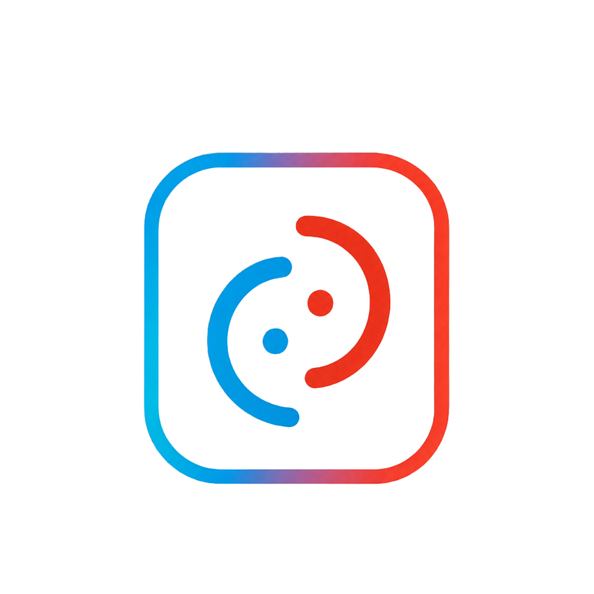
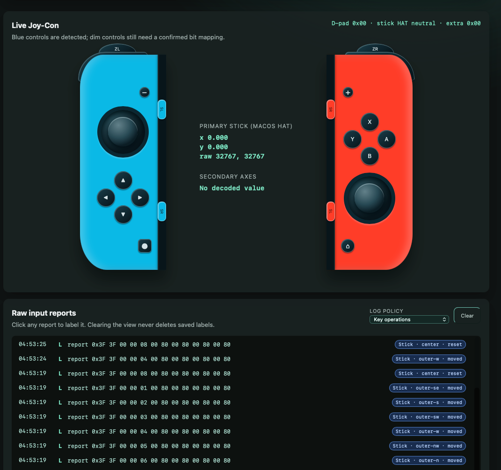
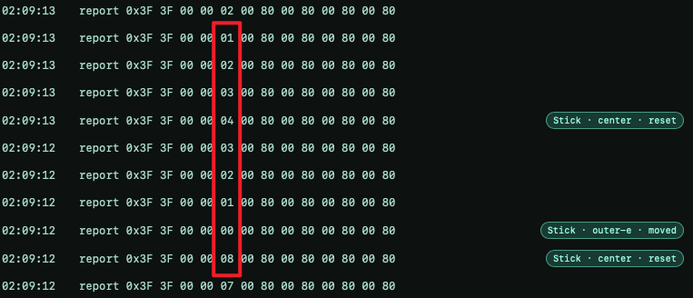

<p align="center">
  
</p>

<h1 align="center">VibeCon</h1>

<p align="center">
  把闲置手柄变成一块可观察、可配置的 Vibe Coding 控制台。
</p>

<p align="center">
  <a href="#安装-macos-预览版"></a>
  <a href="#当前能力"></a>
  <a href="#windows"></a>
  <a href="./README.md"></a>
</p>

<p align="center"><a href="./README.md">English README</a></p>

<p align="center">
  
</p>

> **早期原型。** 目前在 macOS 上开发、验证；Tauri + Rust 的结构为跨平台而设计，但 Windows 输入与窗口切换尚未实机验证。

## 安装 macOS 预览版

1. 从 [GitHub Releases](https://github.com/CoderSerio/vibecon/releases) 下载适用于 Apple Silicon Mac 的 `.dmg`。
2. 打开镜像，把 `VibeCon.app` 拖入「应用程序」。
3. 当前预览版使用 ad-hoc 签名，但**还没有 Apple 公证**。macOS 可能提示「Apple 无法验证」。拖入应用程序后，在 Terminal 执行一次：

   ```sh
   xattr -dr com.apple.quarantine "/Applications/VibeCon.app"
   ```

4. 从「应用程序」打开 `VibeCon`。启用窗口切换或实验性的鼠标控制时，需要再授予辅助功能权限。

这条命令只应对从本仓库下载的 Release 使用。Developer ID 签名与 Apple Notarization 会在之后的公开版本中补上。

## 它是什么？

VibeCon 从一个很朴素的想法开始：与其买一个昂贵又封闭的「Vibe Coding 键盘」，不如把已有的 Joy-Con 或其他手柄，变成一块真正可理解、可检查的物理控制面板。

它不会一上来就自动化。第一步是把输入看清楚：原始 HID 报文、摇杆、按键高亮、采样频率和本地打标；之后再让你主动开启一项足够小、可以审阅的映射。

<p align="center">
  <a href="./docs/media/vibecon-window-switch-demo.mp4">
    
  </a><br>
  <sub>Joy-Con 实机切换窗口演示。点击查看原始视频。</sub>
</p>

## 当前能力

- 通过 Tauri/Rust 原生 HID 后端发现已配对的 **Joy-Con (L)** 和 **Joy-Con (R)**。
- 可同时选中左右两只手柄；日志按一个时间戳分组，并对齐显示 L/R 两行报文。
- 解码 Joy-Con 原生 `0x30` 与 macOS 紧凑 `0x3F` report，包括按钮 bitfield 和已观测到的八方向 HAT。
- 解码每条原生 `0x30` report 中按时间排列的三组 IMU 子采样，并全部送入 Fusion AHRS；UI 降频不会再丢失中间的运动数据。
- 使用可交互的 3D 模型展示左右 Joy-Con：摇杆会倾斜、按键会高亮；开启运动跟随后，模型只绕固定点旋转。点击复位会把当前竖握姿态设为视觉基准。
- 发布包使用完全由 Three.js 基础几何体构成、可合法分发的 Joy-Con；第三方精细参考 GLB 仅用于本地开发，不会作为独立模型文件进入 Release。
- 展示融合姿态诊断信息，包括统一坐标后的陀螺仪三轴、角速度、采样周期、加速度计拒绝状态和运行时零偏估计。
- 日志策略可选：关键操作、旧版 75ms 快照、60/30/10 Hz 采样或每一条 report；也可以随时清空当前可见日志。
- 对抓到的 report 打标：摇杆点位或按键按下/抬起。数据只保存在 `~/.vibecon/annotations.jsonl`，再次命中时会回显标签。
- **已验证的 macOS 映射：** **Codex Cowork** 用 Joy-Con (L) 摇杆向左/向右切换窗口，用 Joy-Con (L) 的方向上或 Joy-Con (R) 的 X 聚焦 Codex。**Inspect Only** 则刻意不发送任何操作。每个绑定都需要显式开启并保存在 `~/.vibecon/mappings.json`。输入日志页默认保持映射运行，需要专心调试时可临时开启「暂停映射」。新动作只会在真机验证后逐项加入。
- **实验性鼠标控制：** 摇杆模式用摇杆移动光标；短按摇杆是左键，按住摇杆并推动是拖拽，L/R 是右键，ZL/ZR + 摇杆滚动页面，ZL/ZR + 其他按键提供 Control 修饰层。体感模式把可配置的 `30°–120°` Joy-Con 旋转映射到当前显示器，并保留原有的 clutch 行为。SL/SR 调节摇杆速度或体感精度，短按 −/+ 复位，长按 −/+ 切换模式。独立测试会回读实际光标坐标，不会只凭事件发送调用成功就宣称鼠标可用。
- **实验性 Joy-Con 输出：** Mappings 页面提供一个手动、短促的 **测试已选 Joy-Con 震动** 脉冲。它不会被绑定或任务事件自动触发；任何 HID 写入失败都会显示出来且不会重试。

### 已观测到的 Joy-Con 规律

当前 macOS 蓝牙 HID 路径中，紧凑 `0x3F` report 将 Joy-Con (L) 摇杆暴露为八方向 HAT：`0–7` 对应方向，`8` 是中立。按钮字节是 bitmask：应按字节使用位与/位或解析，不能把整条 HEX 当作一个可直接相加的数。



## 从源码运行

前置条件：已安装当前版本的 Node.js、pnpm 与 Rust toolchain。

```sh
cd /Users/carbon/Desktop/vibecon
pnpm install
pnpm tauri dev
```

先在 **系统设置 → 蓝牙** 配对 Joy-Con。在 VibeCon 中点击 **Refresh controllers**，选中一个或两个 Joy-Con，然后摇动摇杆或按下按键。

> 不要用 `pnpm dev` 测手柄。它只启动浏览器里的 Vite UI，没有 Tauri Rust 后端，也没有本地 HID 权限。

## 配置 macOS 映射

1. 在 **Debug** 页面选中要使用的手柄。需要两个 Codex 聚焦按键时，左右两侧都选中。
2. 打开 **Mappings**，选择 **Codex Cowork**，然后按需开启总开关与已验证的单项绑定。**Inspect Only** 则刻意不发送快捷操作。上方共享的手柄预览保持实时，只会把最下方的原始日志替换成映射面板。
3. 窗口切换、鼠标移动与点击都需要给 VibeCon 授予 **辅助功能** 权限。映射面板会显示当前运行构建的精确路径、主动请求权限，并提供独立的鼠标移动测试。

窗口切换直接通过 macOS Quartz 发送快捷键，因此只需要 **辅助功能** 权限；聚焦 Codex 使用系统应用启动器，不需要辅助功能权限。

鼠标 MVP 支持摇杆模式与体感模式，具体实现与真机验证步骤见[工程记录](./docs/pointer-control-mvp.zh-CN.md)。

### 用 Agent 编辑预设

映射是位于 `~/.vibecon/mappings.json` 的可读 JSON。点击 **Copy Agent Prompt** 可以复制 schema 与安全边界给编码 Agent。VibeCon 只接受已知 Joy-Con 控件，以及已验证的 `window_previous`、`window_next`、`focus_codex` 三个动作；它不会从映射文件执行任意 shell 命令。点击 **Reset defaults** 可恢复已验证的内置配置。

## 开发

```sh
pnpm build                    # TypeScript + Vite
cd src-tauri && cargo check   # Rust/Tauri/HID 后端
```

在 macOS 上，`pnpm tauri dev` 会生成 `VibeCon Dev.app`。如果钥匙串中存在 Apple Development identity，本地 runner 会签名整个 bundle，使开发应用拥有稳定的 code requirement；Rust 热更新后辅助功能权限不应再因 `cdhash` 变化而失效。

```text
src/App.vue                         Vue 调试与映射界面
src/components/ThreeJoyCon.vue      可交互的 3D Joy-Con 调试器
src/motion/tracker-coordinate.ts    Tracker 与 GLB 坐标契约
src-tauri/src/lib.rs                HID、Fusion 姿态与原生命令
docs/images/                        Logo 与 README 截图
```

当前 release candidate 的真机检查步骤见
[0.0.7 手动 QA 清单](./docs/qa-0.0.7.md)。

## Windows

桌面 UI 与控制器核心没有绑定 Swift 或 macOS API；但当前窗口切换只实现了 macOS，Windows 的 HID 行为也还需要真机测试。Windows 是明确目标，不是当前兼容性承诺。

## 接下来

- Joy-Con、DualSense、Xbox、8BitDo 的 profile 与校准；
- 更多明确、可审阅、按平台申请权限的映射；
- 基于已验证姿态链路的运动校准与明确手势映射；
- 可导出、可共享的控制器 profile。

## 隐私

手柄 report 与打标都只保留在本地，VibeCon 不发送遥测。它只会执行你明确开启的窗口切换和 Codex 聚焦；不会执行 shell 命令，也不会自动批准 AI Agent 操作。

## License

[MIT](./LICENSE) © 2026 CoderSerio。
